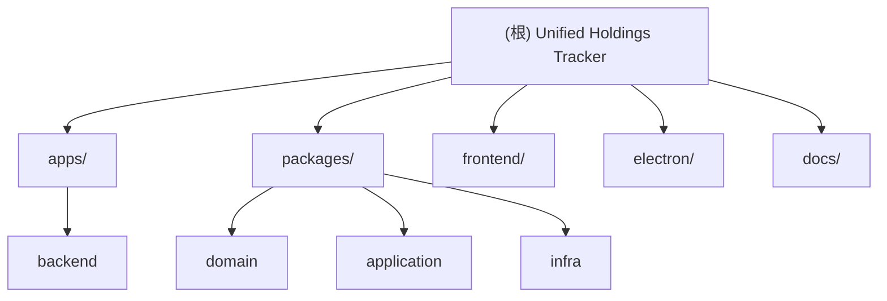

<!-- OPENSPEC:START -->

# OpenSpec Instructions

These instructions are for AI assistants working in this project.

Always open `@/openspec/AGENTS.md` when the request:

- Mentions planning or proposals (words like proposal, spec, change, plan)
- Introduces new capabilities, breaking changes, architecture shifts, or big performance/security work
- Sounds ambiguous and you need the authoritative spec before coding

Use `@/openspec/AGENTS.md` to learn:

- How to create and apply change proposals
- Spec format and conventions
- Project structure and guidelines

Keep this managed block so 'openspec update' can refresh the instructions.

<!-- OPENSPEC:END -->

# Unified Holdings Tracker - AI 上下文文档

> 最后更新：2025-11-16 08:55:50

## 变更记录 (Changelog)

### 2025-11-16

- 初始化 AI 上下文文档
- 生成根级和模块级架构文档
- 建立模块索引和结构图

---

## 项目愿景

Unified Holdings Tracker 是一个基于 Electron + React + Node.js 构建的桌面投资组合管理应用，旨在为个人投资者提供全面的持仓跟踪、交易记录管理、市场数据展示和投资分析功能。

**核心价值**：

- 统一管理多市场（中国A股、港股、美股）投资组合
- 实时市场数据获取与展示
- 杠杆成本、分红、手续费等精细化记录
- 投资组合年化收益率等关键指标计算
- 本地数据存储，保护隐私

---

## 架构总览

本项目采用 **Monorepo + 分层架构** 设计：

### 技术栈

- **桌面框架**：Electron 35+
- **前端**：React 19 + TypeScript + Vite + Ant Design 5
- **后端**：Node.js + Express 5 + TypeScript
- **数据库**：SQLite + Prisma ORM
- **状态管理**：Zustand
- **构建工具**：npm workspaces, Electron Forge, Inno Setup

### 架构模式

- **DDD 分层**：Domain（领域层）→ Application（应用层）→ Infrastructure（基础设施层）
- **前后端分离**：后端提供 RESTful API，前端通过 Axios 调用
- **Electron 集成**：主进程管理窗口和后端服务，渲染进程运行前端应用

---

## 模块结构图



---

## 模块索引

| 模块路径               | 职责                                            | 主要技术                            | 文档链接                                                                |
| ---------------------- | ----------------------------------------------- | ----------------------------------- | ----------------------------------------------------------------------- |
| `apps/backend`         | 后端 API 服务，提供投资组合、交易、市场数据接口 | Express, Prisma, TypeScript         | [查看](d:/Unified.Holdings.Tracker-main/apps/backend/CLAUDE.md)         |
| `packages/domain`      | 领域层，定义核心实体、值对象和仓储接口          | TypeScript, DDD                     | [查看](d:/Unified.Holdings.Tracker-main/packages/domain/CLAUDE.md)      |
| `packages/application` | 应用层，实现业务用例（Use Cases）               | TypeScript                          | [查看](d:/Unified.Holdings.Tracker-main/packages/application/CLAUDE.md) |
| `packages/infra`       | 基础设施层，实现数据访问、缓存、外部 API 调用   | Prisma, Axios, node-cache           | [查看](d:/Unified.Holdings.Tracker-main/packages/infra/CLAUDE.md)       |
| `frontend`             | 前端 React 应用，提供用户界面                   | React 19, Vite, Ant Design, Zustand | [查看](d:/Unified.Holdings.Tracker-main/frontend/CLAUDE.md)             |
| `electron`             | Electron 主进程，管理窗口和应用生命周期         | Electron 35, TypeScript             | [查看](d:/Unified.Holdings.Tracker-main/electron/CLAUDE.md)             |

---

## 运行与开发

### 环境要求

- Node.js 18+ (推荐 LTS 版本)
- npm 9+

### 快速启动

```bash
# 1. 安装所有依赖（workspace 模式）
npm install

# 2. 启动后端服务（开发模式）
npm run dev:backend
# 后端将运行在 http://localhost:3001

# 3. 启动前端开发服务器（新终端）
npm run dev:frontend
# 前端将运行在 http://localhost:5173

# 4. Electron 调试（可选，新终端）
npm run watch:electron   # TypeScript watch
npm run start:electron   # 启动主进程
```

### 数据库初始化

```bash
# 生成 Prisma Client
npm run prisma:generate -w backend

# 推送 schema 到 SQLite
npm run db:push -w backend

# 从 JSON 迁移数据（如果有旧数据）
npm run migrate:json -w backend
```

### 构建与打包

```bash
# 构建后端
npm run build -w backend

# 构建前端
npm run build -w frontend

# 构建 Electron
npm run build:electron

# 打包 Electron 应用（使用 Electron Forge）
cd electron
npm run package
npm run make
```

---

## 测试策略

### 后端测试

- **框架**：Jest + ts-jest
- **覆盖范围**：
  - 服务层单元测试（`apps/backend/src/services/__tests__/`）
  - 缓存服务、API 调用、数据验证
- **运行**：`npm run test:backend`

### 前端测试

- **框架**：Vitest + React Testing Library
- **覆盖范围**：
  - 组件单元测试（`frontend/src/components/legacy/__tests__/`）
  - 工具函数测试（`frontend/src/utils/__tests__/`）
- **运行**：`npm run test -w frontend`

### 测试覆盖率目标

- 核心业务逻辑：80%+
- 工具函数：90%+
- UI 组件：60%+（重点测试交互逻辑）

---

## 编码规范

### TypeScript

- 启用严格模式（`strict: true`）
- 优先使用接口（interface）定义对象类型
- 避免使用 `any`，必要时使用 `unknown`
- 使用 `type` 定义联合类型和工具类型

### 代码风格

- **格式化**：Prettier（配置见 `.prettierrc`）
- **检查**：ESLint（配置见 `eslint.config.mjs`）
- **提交前检查**：Husky + lint-staged
- **命名约定**：
  - 文件名：kebab-case（`portfolio-service.ts`）
  - 组件：PascalCase（`PortfolioList.tsx`）
  - 函数/变量：camelCase（`getPortfolio`）
  - 常量：UPPER_SNAKE_CASE（`API_BASE_URL`）

### Git 工作流

- 主分支：`main`
- 功能分支：`feature/xxx`
- 修复分支：`fix/xxx`
- 提交信息：遵循 Conventional Commits（`feat:`, `fix:`, `docs:`, `refactor:` 等）

---

## AI 使用指引

### 代码生成建议

1. **优先阅读现有代码**：理解项目架构和编码风格
2. **遵循分层原则**：
   - Domain 层不依赖外部库
   - Application 层只依赖 Domain
   - Infrastructure 层实现 Domain 定义的接口
3. **类型安全**：充分利用 TypeScript 类型系统
4. **测试驱动**：为新功能编写测试用例

### 常见任务

- **添加新 API 端点**：
  1. 在 `apps/backend/src/routes/` 添加路由
  2. 在 `packages/application/src/use-cases/` 添加用例
  3. 更新 OpenAPI 文档（`apps/backend/src/openapi.ts`）

- **添加新实体**：
  1. 在 `packages/domain/src/entities/` 定义实体
  2. 在 `apps/backend/prisma/schema.prisma` 添加模型
  3. 运行 `npm run db:push -w backend`

- **添加新前端页面**：
  1. 在 `frontend/src/features/` 创建功能模块
  2. 在 `frontend/src/app/routes/` 添加路由
  3. 使用 Ant Design 组件保持 UI 一致性

### 文档维护

- 修改架构时更新本文档
- 添加新模块时创建对应的 `CLAUDE.md`
- 重要决策记录在 `docs/` 目录

---

## 相关资源

- **项目仓库**：https://github.com/cuowuxuexi/Unified.Holdings.Tracker
- **技术文档**：`docs/` 目录
- **API 文档**：http://localhost:3001/api/openapi.json（开发环境）
- **问题追踪**：GitHub Issues

---

## 附录：目录结构

```
d:\Unified.Holdings.Tracker-main\
├── apps/
│   └── backend/              # 后端服务
│       ├── prisma/           # Prisma schema 和迁移
│       ├── src/
│       │   ├── routes/       # API 路由
│       │   ├── services/     # 业务服务
│       │   ├── config/       # 配置管理
│       │   └── server.ts     # 服务器入口
│       └── package.json
├── packages/
│   ├── domain/               # 领域层
│   │   └── src/
│   │       ├── entities/     # 实体定义
│   │       ├── repositories/ # 仓储接口
│   │       └── value-objects/# 值对象
│   ├── application/          # 应用层
│   │   └── src/
│   │       └── use-cases/    # 业务用例
│   └── infra/                # 基础设施层
│       └── src/
│           ├── cache/        # 缓存实现
│           ├── database/     # 数据库客户端
│           ├── providers/    # 外部服务提供者
│           └── storage/      # 数据存储实现
├── frontend/                 # 前端应用
│   ├── src/
│   │   ├── app/              # 应用配置和路由
│   │   ├── components/       # UI 组件
│   │   ├── features/         # 功能模块
│   │   ├── shared/           # 共享代码
│   │   ├── store/            # 状态管理
│   │   └── main.tsx          # 前端入口
│   └── package.json
├── electron/                 # Electron 主进程
│   ├── launcher/             # 应用启动器
│   ├── forge.config.js       # Electron Forge 配置
│   └── package.json
├── docs/                     # 项目文档
│   ├── notes/                # 开发笔记
│   └── reports/              # 报告
├── .gitignore                # Git 忽略规则
├── package.json              # 根 package.json（workspace 配置）
├── tsconfig.base.json        # TypeScript 基础配置
└── README.md                 # 项目说明
```
